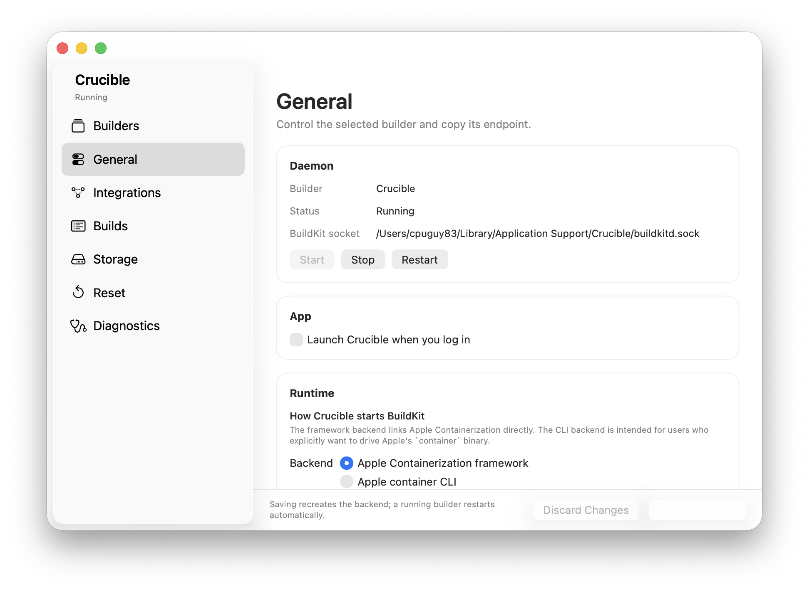
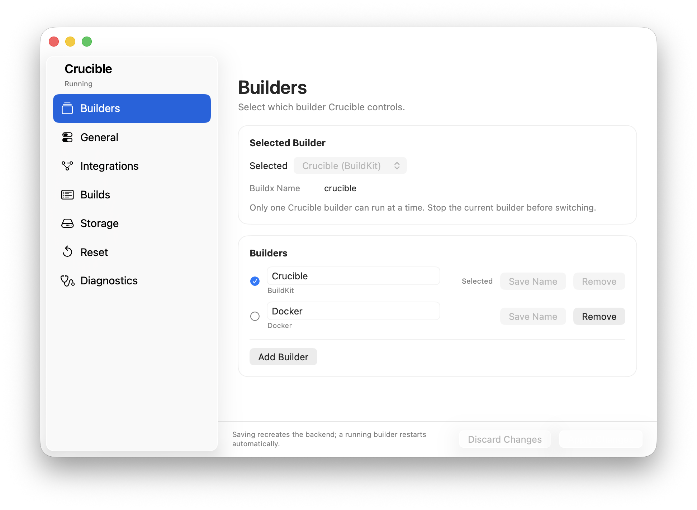
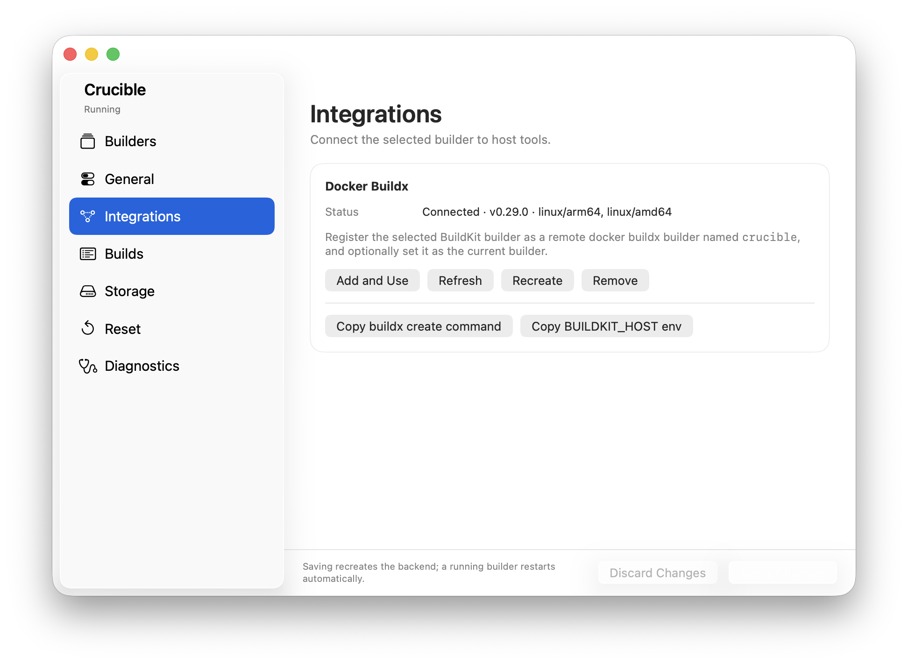
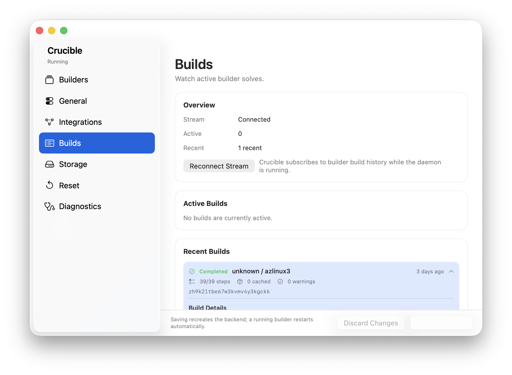
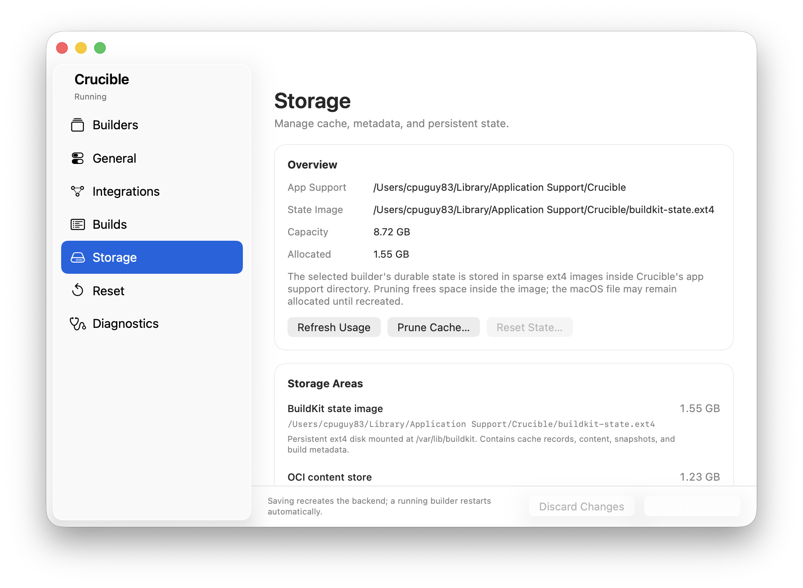
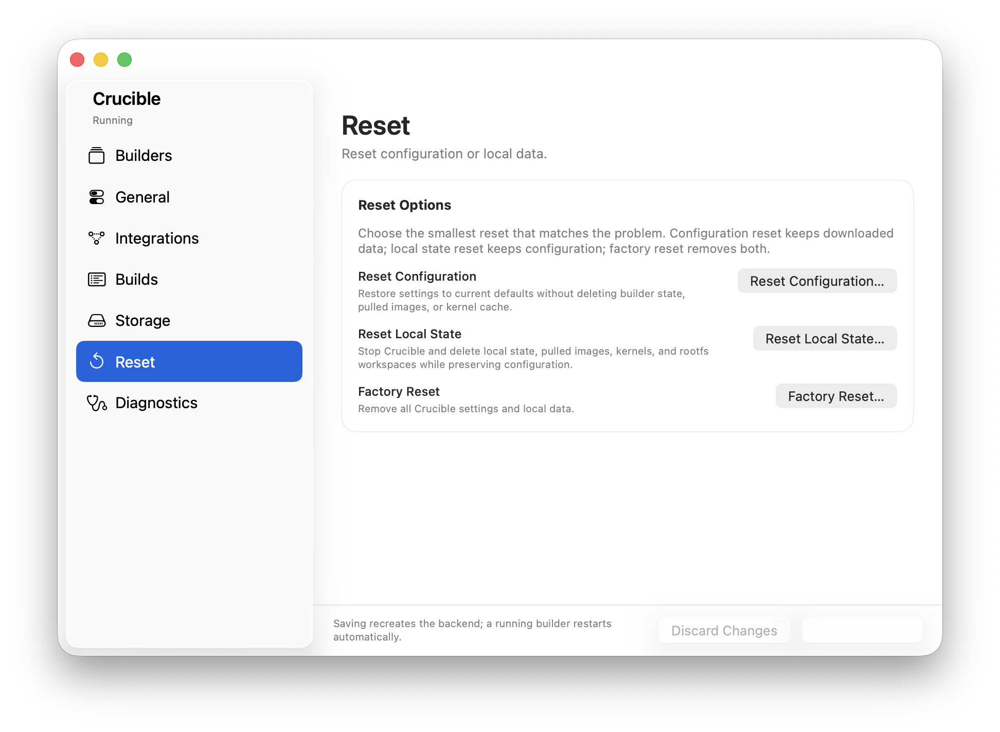
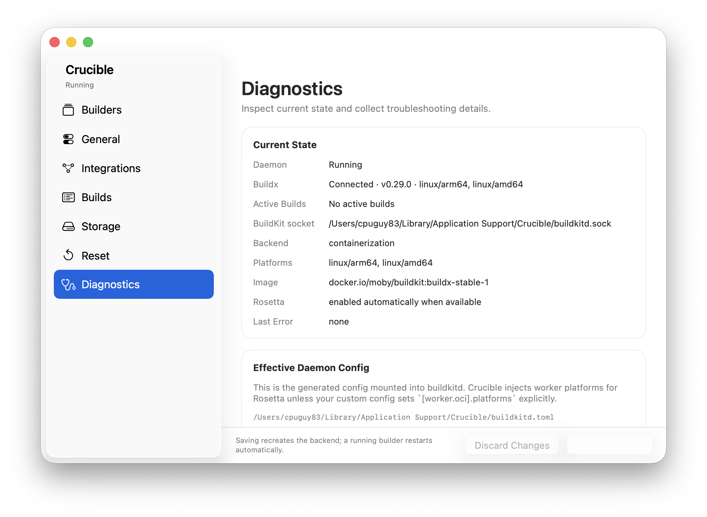
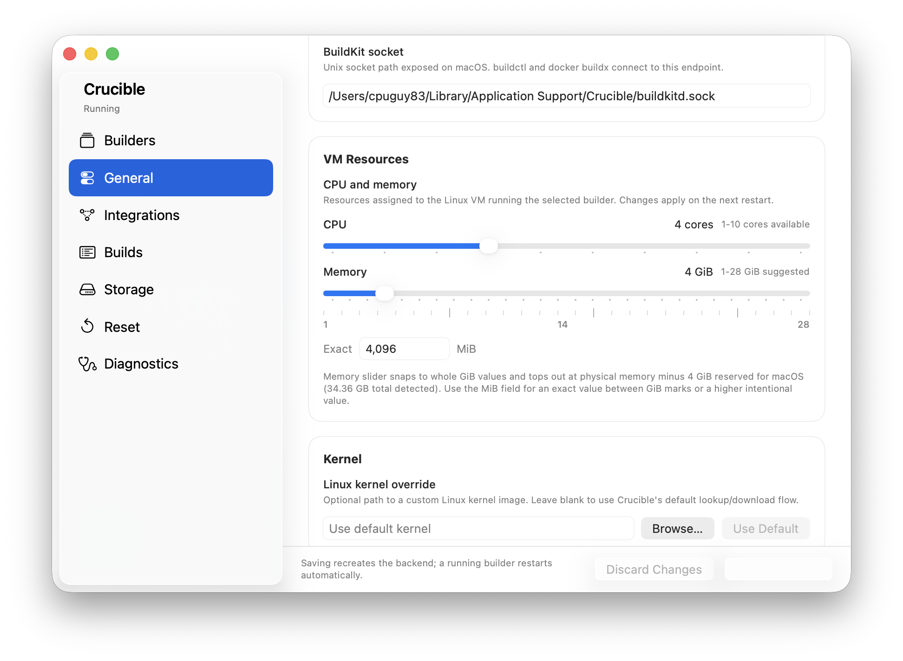
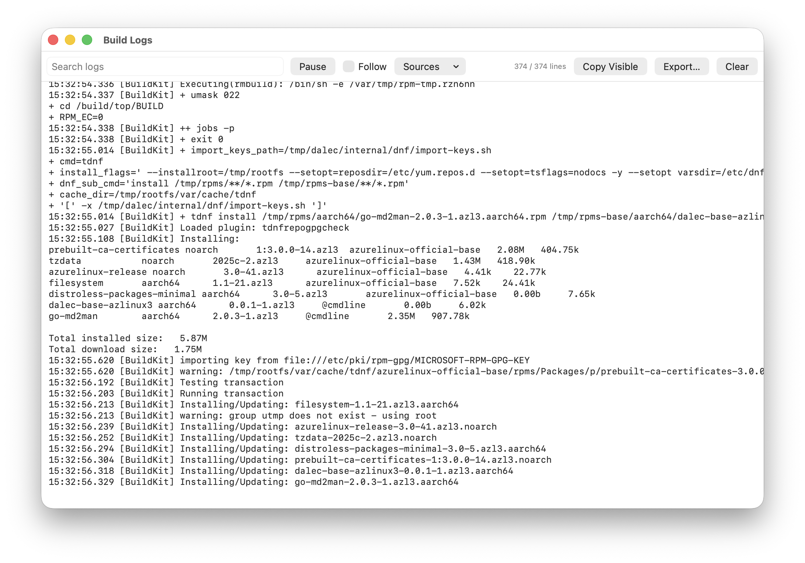
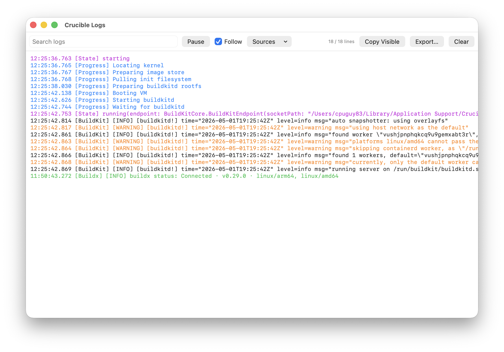

# Crucible

Crucible is a macOS menu bar app for managing a BuildKit builder running in an
Apple Containerization VM.

It helps you:

- Run and supervise BuildKit from the macOS menu bar.
- Connect `docker buildx`, `buildctl`, and other build tools to that builder.
- Use a dockerd-backed builder when you want to run the images you build.

Crucible is intended for people who want native macOS controls around builder
lifecycle, logs, storage, and integration with existing build tools.

> Status: **early / experimental**. Apple silicon + macOS 26 only.

## Screenshots

Crucible keeps builder controls, integrations, diagnostics, and logs in a native
macOS settings window.

| General | Builders |
| --- | --- |
|  |  |

| Integrations | Builds |
| --- | --- |
|  |  |

| Storage | Reset |
| --- | --- |
|  |  |

| Diagnostics | VM Resources |
| --- | --- |
|  |  |

| Build Logs | App Logs |
| --- | --- |
|  |  |

## What It Does

- Starts, stops, and restarts the selected BuildKit builder from the menu bar.
- Runs the builder in a lightweight Linux VM through Apple's Containerization
  framework.
- Exposes local sockets for host tools like `docker`, `docker buildx`, and
  `buildctl`.
- Supports multiple saved builders while keeping only one selected builder
  running at a time.
- Shows logs, current state, active builds, and recent build history.
- Provides storage usage, cache pruning, reset controls, and diagnostics.
- Can create and remove CLI integrations for the selected builder.

## Builders

### BuildKit

The BuildKit builder runs upstream `moby/buildkit:buildx-stable-1` by default.
It exposes a local BuildKit socket and works well with `docker buildx` or
`buildctl`.

The app can register a buildx builder for you from **Settings > Integrations**.

Manual `buildctl` usage looks like:

```bash
BUILDKIT_HOST="unix://$HOME/Library/Application Support/Crucible/buildkitd.sock" buildctl debug workers
```

### Dockerd-Based Builder

For workflows where you want to build an image and then run the result,
Crucible can run a managed Docker daemon in a Linux VM using the
Containerization framework. This exposes a Docker socket for the host Docker CLI
and Docker buildx.

The app can create either a Docker context or a Docker buildx builder from
**Settings > Integrations**. These integrations are mutually exclusive for the
selected dockerd-based builder, and the UI lets you switch between them.

To bind-mount host directories into containers, add them under
**Settings > Mounts**. Each entry is shared into the VM at the same path it has
on your Mac, so a host path like `/Users/me/proj` appears at `/Users/me/proj`
inside the guest and `docker run -v /Users/me/proj:/app` resolves as expected.
Mounts can be marked read-only, and changes apply on the next Docker restart.

File contents are shared live in both directions, but host-side changes are not
delivered as `inotify` events inside the guest (a limitation of the
Virtualization framework's virtiofs share). File watchers running in a
container — for example `vite`, `nodemon`, or `air` — may therefore miss host
edits and need polling mode (e.g. `CHOKIDAR_USEPOLLING=1`).

## Requirements

- Apple silicon Mac.
- macOS 26 Tahoe.
- Xcode 26 / Swift 6.x if building from source.
- Docker CLI if you want Docker context/buildx integration helpers.
- `buildctl` if you want to use BuildKit directly from the terminal.

## Install From Source

```bash
make app
make run
```

Useful development commands:

```bash
make build      # build Swift package libraries
make test       # run unit tests
make app        # build Crucible.app via xcodebuild
make run        # build and launch Crucible.app
make dist       # build build/dist/Crucible.zip
```

The Xcode project is generated from `project.yml` with
[XcodeGen](https://github.com/yonaskolb/XcodeGen). Both `project.yml` and the
generated `Crucible.xcodeproj` are committed. Regenerate with:

```bash
make project
```

## Typical Workflow

1. Launch Crucible.
2. Open **Settings > Builders** and choose or create a builder.
3. Start the selected builder from the menu bar.
4. Open **Settings > Integrations** and create the matching Docker/buildx
   integration if you want CLI convenience.
5. Build from your terminal with `docker buildx build`, `docker build`, or
   `buildctl`, depending on the selected builder and integration.

## Storage And Reset

Crucible stores settings and builder state under:

```text
~/Library/Application Support/Crucible
```

The default BuildKit builder keeps legacy state directly in that directory.
Additional builders use builder-specific directories under `builders/<id>/`.

Removing a builder from the app also removes that builder's local state, cache,
and build history.

## Repository Layout

```text
Package.swift               # Swift package libraries and test targets
Sources/
  BuildKitCore/             # settings, storage paths, supervisor, protocols
  BuildKitContainerization/ # Apple Containerization-backed runtimes
  BuildKitContainerCLI/     # optional Apple container CLI BuildKit backend
Apps/Crucible/              # macOS app target
Tests/                      # unit tests
docs/                       # roadmap, screenshots, design notes
```

## Smoke Tests

The headless smoke driver needs the virtualization entitlement when using the
framework backend:

```bash
swift build --product crucibled
codesign --force --sign - --entitlements Apps/Crucible/Resources/Crucible.entitlements .build/debug/crucibled
.build/debug/crucibled --smoke
```

The optional BuildKit CLI backend can be smoked independently:

```bash
swift build --product crucibled
.build/debug/crucibled --backend cli --smoke
```

To verify a running BuildKit builder from the host:

```bash
BUILDKIT_HOST="unix://$HOME/Library/Application Support/Crucible/buildkitd.sock" buildctl debug workers
docker buildx inspect crucible
```

Expected worker platforms include `linux/arm64` and `linux/amd64` on Apple
silicon when Rosetta is available.

## Release Builds

Local zip builds do not require signing credentials:

```bash
make dist
```

Developer ID release/notarization targets use environment variables:

```bash
DEVELOPER_ID_APPLICATION="Developer ID Application: Example (TEAMID)" make release-zip
NOTARY_PROFILE="notarytool-keychain-profile" make notarize
make staple
```

## License

Apache-2.0. See [LICENSE](LICENSE).
